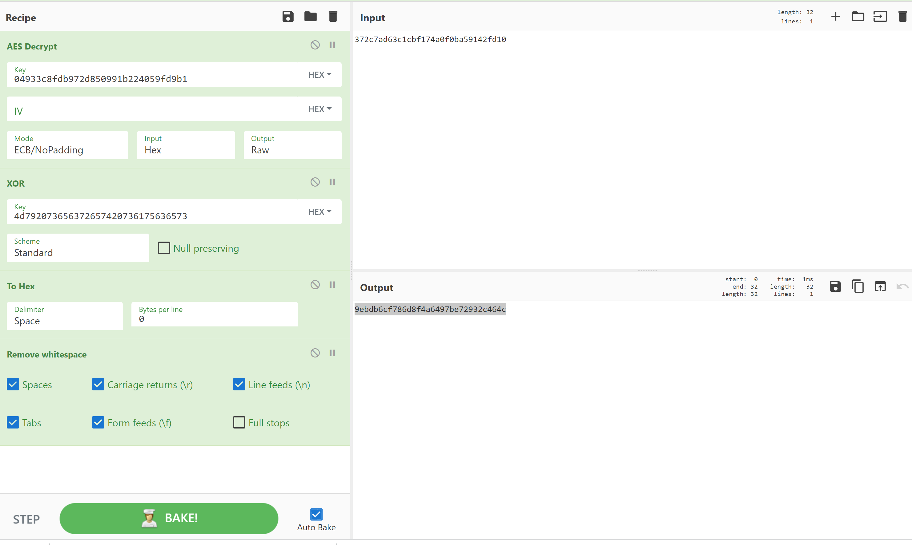

### A Crack Between The Blocks

**description**: Investigators recovered various securely encrypted files from a criminals machine. However, the criminal left behind details of a test encryption they had performed, but had left out the Intialization Vector (IV). Can you help discover what the IV was?
Enter the IV in the flag in hexadecimal format and all lowercase characters. Example: flag{0123456789abcdef}

**attachment**: a txt file containing the following information
```
Known plain text (UTF8): `My secret sauces`
Known key (Hex): `04933c8fdb972d850991b224059fd9b1`
Known cipher text (Hex): `372c7ad63c1cbf174a0f0ba59142fd10
```

##### Solution:

Found some suggested solution of how to calculate the IV on [stackexchange](https://crypto.stackexchange.com/questions/76512/given-the-key-the-plain-text-and-the-cipher-text-can-i-calculate-the-iv-used-in): 

>Just decrypt first 8 bytes encrypted buffer(1 block) in ECB mode (You only need encrypted buffer and key to do so) and then xor the result with the input buffer. Result will be IV.

With a bit modification and testing and the help of CyberChef, I got the IV in the output

