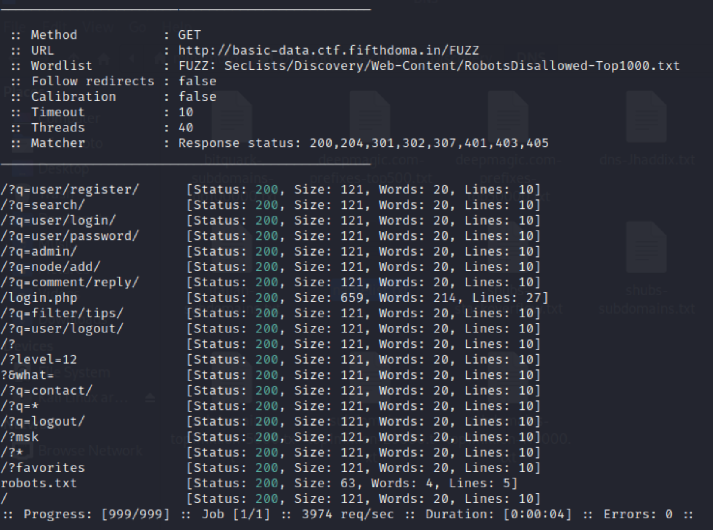
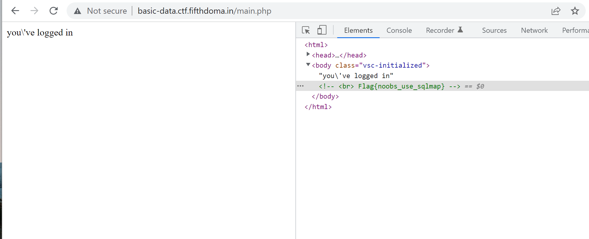

### Basic Data

**Description**: Sometimes data is deceiving. http://basic-data.ctf.fifthdoma.in/

##### Solution:

The website is a very simple page showing "try harder" and with nothing else.

**Step 1**: use `ffuf` and [SecLists](https://github.com/danielmiessler/SecLists) to brute force subdomains:

I used "common.txt" first but the result didn't provide much new information, so tried some other lists and finally find something interest: the `/login.php` page

**Step 2**: SQL injection in to the login page

Use the simple `' or 1=1` in both username and password file, and I'm in! The flag is shown in the source code:

