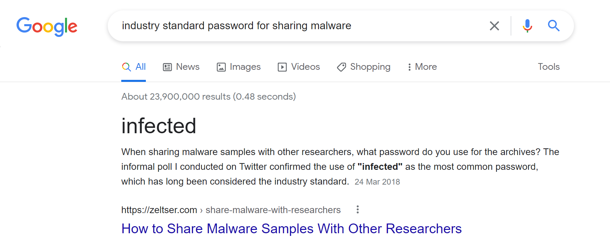

### botnet infection

**Description**: Use the industry standard password for malware samples to triage this malware binary. What's the name of the malware botnet family? the flag format is FLAG{xxxxxxx} (x is lowercase, 7 characters) WARNING: THIS IS REAL MALWARE, DO NOT EXECUTE.

**Attachment**: a zip file containing the malware. I immediately deleted it once got the flag...

##### Solution:

Google "industry standard password for sharing malware" to find "infected" to unzip the file:

Let Windows Security scan the folder containing the file, and it would show the malware belongs to the **Xorddos**:

