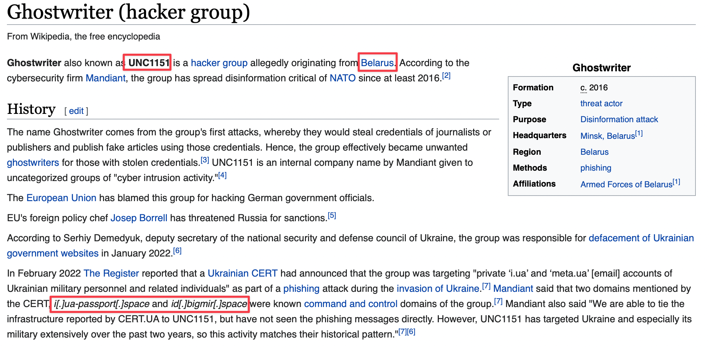

### Phishing in a cyber war

**Description**: A malicious actor is conducting social engineering attacks against Ukrainian officials. It also has targeted other countries around the region in the past. We are given some examples of domains it uses for phishing: ron-mil-pl[.]space ua-login[.]site passport-yandex[.]ru Can you give us more information? 
- Q1 What is the code name for the group used by Mandiant and FireEye for reporting? (All upper case) 
- Q2 Which country is this group based in? (Capitalized) 
- Q3 What are the two domains used in the February attacks against Ukraine, as published by Ukrainian officials? (all lower case, with no []s) 

Flag format: FLAG{CODENAME_Country_domain.number.one_domain.number.two}

#### Solution:

By googling the domain names mentioned above, it can be seen that the hacker group is called "Ghostwriter". I tried to read though the news or FireEye's reports about them, but later realized that the answers to all the questions can be found in their Wikipedia page:

